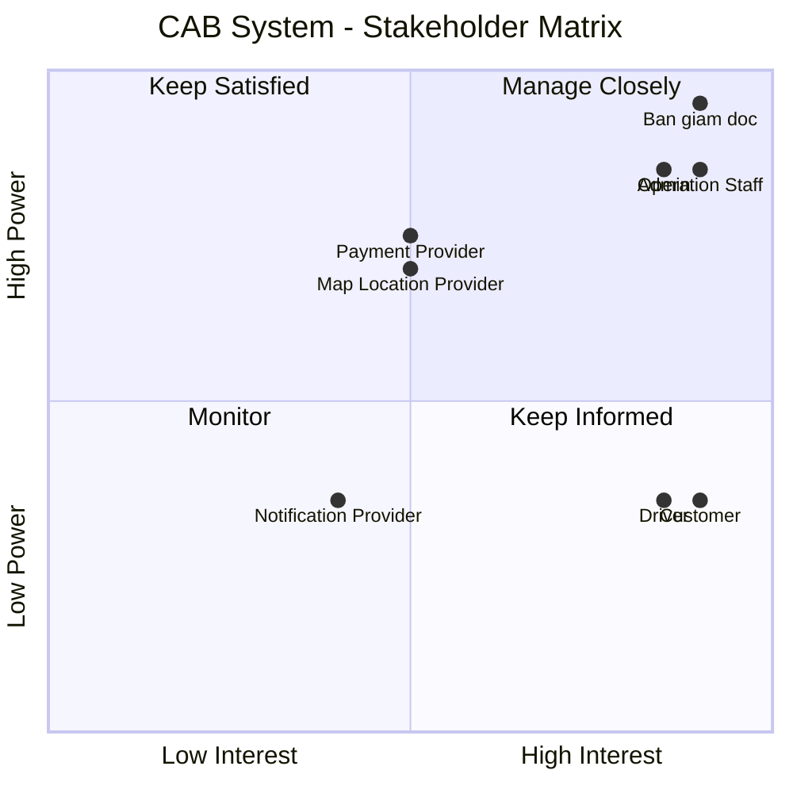
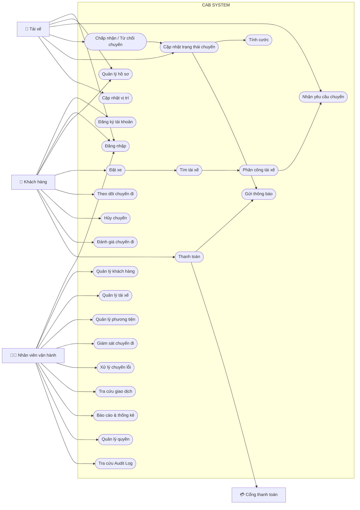
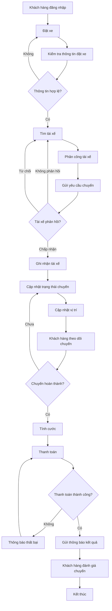

**Dự án xây dựng hệ thống CAB System – Nền tảng đặt xe**


## 1. Vấn đề hiện tại

Hệ thống đặt xe hiện tại của công ty ABC còn tồn tại nhiều hạn chế:

- Việc đặt xe chủ yếu thông qua tổng đài hoặc ứng dụng đơn giản, chưa mang lại trải nghiệm thuận tiện cho khách hàng.
- Việc phân công tài xế chủ yếu được thực hiện thủ công, dẫn đến xử lý chậm và khó mở rộng.
- Khách hàng khó theo dõi trạng thái yêu cầu đặt xe và trạng thái chuyến đi.
- Khách hàng không thể dễ dàng biết tài xế nào đã nhận chuyến và thời gian dự kiến tài xế đến.
- Khi tài xế từ chối hoặc không phản hồi, hệ thống chưa có cơ chế tự động tìm tài xế khác hiệu quả.
- Thông tin thanh toán chưa được quản lý tập trung.
- Khách hàng khó tra cứu lịch sử chuyến đi và thông tin giao dịch.
- Bộ phận vận hành gặp khó khăn trong việc quản lý khách hàng, tài xế, phương tiện và các chuyến đi.
- Hệ thống hiện tại khó mở rộng khi số lượng khách hàng và tài xế tăng lên.
- Việc bổ sung tính năng hoặc tích hợp các dịch vụ mới có thể ảnh hưởng đến các chức năng đang hoạt động.


## 2. Stakeholders

| # | Stakeholder | Vai trò |
|---|---|---|
| 1 | **Ban giám đốc** | Chủ dự án, ra quyết định và định hướng kinh doanh |
| 2 | **Khách hàng (Customer)** | Người sử dụng dịch vụ đặt xe |
| 3 | **Tài xế (Driver)** | Người cung cấp dịch vụ vận chuyển |
| 4 | **Nhân viên vận hành (Operation Staff)** | Quản lý và hỗ trợ hoạt động đặt xe |
| 5 | **Admin** | Quản trị hệ thống và phân quyền |
| 6 | **Payment Provider** | Cung cấp dịch vụ thanh toán điện tử |
| 7 | **Notification Provider** | Cung cấp dịch vụ gửi thông báo |
| 8 | **Map / Location Provider** | Cung cấp dịch vụ bản đồ, định vị và ETA |


##  Stakeholder Matrix

| Stakeholder | Power | Interest | Strategy |
|---|---|---|---|
| **Ban giám đốc** | Cao | Cao | **Manage Closely** – Thường xuyên cập nhật tiến độ, rủi ro và các quyết định quan trọng |
| **Khách hàng** | Thấp | Cao | **Keep Informed** – Thu thập feedback và cập nhật các thay đổi ảnh hưởng đến trải nghiệm |
| **Tài xế** | Thấp | Cao | **Keep Informed** – Thu thập nhu cầu, feedback và đảm bảo quy trình nhận/thực hiện chuyến phù hợp |
| **Nhân viên vận hành** | Cao | Cao | **Manage Closely** – Tham gia phân tích nghiệp vụ, kiểm thử và xác nhận quy trình |
| **Admin** | Cao | Cao | **Manage Closely** – Tham gia xác định yêu cầu quản trị, bảo mật và phân quyền |
| **Payment Provider** | Cao | Trung bình | **Keep Satisfied** – Đảm bảo tích hợp, giao dịch và xử lý lỗi hoạt động ổn định |
| **Notification Provider** | Trung bình | Trung bình | **Monitor** – Theo dõi khả năng tích hợp và trạng thái dịch vụ |
| **Map/Location Provider** | Cao | Trung bình | **Keep Satisfied** – Đảm bảo dữ liệu vị trí, khoảng cách và ETA hoạt động ổn định |


(MERMAID)

##  3. Mục đích nghiệp vụ

| ID | Mục đích nghiệp vụ | Mô tả |
|---|---|---|
| BO-01 | **Cải thiện trải nghiệm khách hàng** | Giúp khách hàng đặt xe nhanh chóng, dễ dàng theo dõi chuyến đi và quản lý thông tin thanh toán. |
| BO-02 | **Tự động hóa quy trình đặt xe** | Giảm sự phụ thuộc vào thao tác thủ công trong việc tiếp nhận yêu cầu và phân công tài xế. |
| BO-03 | **Nâng cao hiệu quả phân công tài xế** | Tự động tìm và ưu tiên tài xế phù hợp, gần khách hàng và sẵn sàng nhận chuyến. |
| BO-04 | **Nâng cao hiệu quả vận hành** | Cung cấp công cụ giúp nhân viên vận hành theo dõi, quản lý và xử lý các chuyến đi hiệu quả hơn. |
| BO-05 | **Quản lý tập trung dữ liệu** | Tập trung quản lý thông tin khách hàng, tài xế, phương tiện, chuyến đi và giao dịch. |
| BO-06 | **Tăng tính minh bạch trong thanh toán** | Quản lý tập trung thông tin cước và kết quả thanh toán, đồng thời hỗ trợ nhiều phương thức thanh toán. |
| BO-07 | **Nâng cao khả năng giám sát và ra quyết định** | Cung cấp báo cáo về số lượng chuyến, doanh thu, tỷ lệ hoàn thành, tỷ lệ hủy và hiệu quả tài xế. |
| BO-08 | **Đảm bảo khả năng mở rộng** | Xây dựng nền tảng có thể phục vụ số lượng lớn khách hàng và tài xế khi doanh nghiệp phát triển. |
| BO-09 | **Tăng khả năng mở rộng tính năng** | Cho phép bổ sung dịch vụ, phương thức thanh toán, kênh thông báo và các tính năng mới trong tương lai. |
| BO-10 | **Nâng cao độ ổn định và bảo mật** | Đảm bảo hệ thống hoạt động ổn định, bảo vệ dữ liệu và hạn chế ảnh hưởng khi một thành phần gặp sự cố. |


## 4. Kế hoạch triển khai 7 tuần

| Tuần | Module | Nội dung chính |
|---|---|---|
| **Tuần 1** | **M01 - Xác thực & Quản lý tài khoản** | Đăng ký, đăng nhập, xác thực, cập nhật thông tin và phân quyền |
| **Tuần 2** | **M02 - Quản lý khách hàng** + **M03 - Quản lý tài xế & phương tiện** | Hồ sơ khách hàng, tài xế, phương tiện và trạng thái hoạt động |
| **Tuần 3** | **M04 - Đặt xe** | Tạo yêu cầu, điểm đón, điểm đến, loại xe và quản lý yêu cầu đặt xe |
| **Tuần 4** | **M05 - Phân công tài xế** + **M06 - Quản lý chuyến đi & định vị** | Tìm tài xế, phân công, xử lý từ chối/timeout, trạng thái chuyến và vị trí |
| **Tuần 5** | **M07 - Tính cước & thanh toán** | Tính cước, tiền mặt, thanh toán điện tử và xử lý giao dịch thất bại |
| **Tuần 6** | **M08 - Thông báo** + **M09 - Vận hành & quản trị** + **M10 - Báo cáo & kiểm toán** | Thông báo, quản lý vận hành, báo cáo, phân quyền và audit log |
| **Tuần 7** | **Tích hợp & hoàn thiện** | Kiểm thử tích hợp, kiểm thử nghiệm thu, sửa lỗi, kiểm thử hiệu năng, triển khai và bàn giao |


## 5. Yêu cầu nghiệp vụ (Business Requirements)

| ID     | Yêu cầu nghiệp vụ | Mô tả |
|--------|---|---|
| BR-01 | **Đặt xe trực tuyến** | Cho phép khách hàng đặt xe trực tuyến, chọn điểm đi, điểm đến một cách nhanh chóng và thuận tiện. |
| BR-02 | **Tự động tìm và phân công tài xế** | Tự động tìm tài xế phù hợp dựa trên vị trí, trạng thái sẵn sàng và các tiêu chí vận hành. |
| BR-03 | **Theo dõi chuyến đi** | Cho phép khách hàng theo dõi trạng thái chuyến đi, thông tin tài xế và thời gian dự kiến tài xế đến. |
| BR-04 | **Đánh giá chuyến đi** | Cho phép khách hàng đánh giá tài xế sau khi chuyến đi hoàn thành và ghi nhận phản hồi để doanh nghiệp theo dõi chất lượng dịch vụ. |
| BR-05 | **Tính cước** | Xác định số tiền khách hàng phải trả dựa trên thông tin chuyến đi và chính sách tính cước của doanh nghiệp. |
| BR-06 | **Quản lý thanh toán** | Hỗ trợ thanh toán tiền mặt và thanh toán điện tử thông qua nhà cung cấp thanh toán bên ngoài. |
| BR-07 | **Quản lý thông báo** | Gửi thông báo cho khách hàng và tài xế về các sự kiện quan trọng trong quá trình đặt và thực hiện chuyến đi. |
| BR-08 | **Quản lý tài xế và phương tiện** | Cho phép quản lý thông tin tài xế, phương tiện, trạng thái hoạt động và vị trí của tài xế. |
| BR-09 | **Quản lý vận hành** | Cung cấp công cụ để nhân viên vận hành quản lý khách hàng, tài xế, phương tiện, chuyến đi và giao dịch. |
| BR-10 | **Báo cáo và thống kê** | Cung cấp báo cáo về số lượng chuyến, doanh thu, tỷ lệ hoàn thành, tỷ lệ hủy và hiệu quả hoạt động của tài xế. |
| BR-11 | **Bảo mật và kiểm soát truy cập** | Bảo vệ thông tin cá nhân, dữ liệu vị trí, dữ liệu giao dịch và kiểm soát quyền truy cập của người dùng. |
| BR-12 | **Khả năng mở rộng và ổn định** | Đảm bảo hệ thống có thể phục vụ số lượng lớn người dùng và hạn chế ảnh hưởng khi một thành phần gặp sự cố. |
| BR-13 | **Khả năng mở rộng tính năng** | Cho phép bổ sung loại dịch vụ, phương thức thanh toán, kênh thông báo và các tính năng mới trong tương lai. |

## 6. Functional Requirements

### BR-01 - Đặt xe trực tuyến

| ID | Yêu cầu chức năng | Mô tả |
|---|---|---|
| <code>FR-01.1</code> | Nhập điểm đi | Cho phép khách hàng nhập hoặc chọn điểm đón. |
| <code>FR-01.2</code> | Nhập điểm đến | Cho phép khách hàng nhập hoặc chọn điểm đến. |
| <code>FR-01.3</code> | Chọn loại xe | Cho phép khách hàng lựa chọn loại xe phù hợp. |
| <code>FR-01.4</code> | Tạo yêu cầu đặt xe | Cho phép khách hàng gửi yêu cầu đặt xe với các thông tin đã cung cấp. |
| <code>FR-01.5</code> | Kiểm tra thông tin đặt xe | Hệ thống kiểm tra tính hợp lệ của thông tin trước khi tạo yêu cầu. |
| <code>FR-01.6</code> | Xem trạng thái yêu cầu | Cho phép khách hàng xem trạng thái của yêu cầu đặt xe. |
| <code>FR-01.7</code> | Hủy yêu cầu đặt xe | Cho phép khách hàng hủy yêu cầu theo chính sách của doanh nghiệp. |

### BR-02 - Tự động tìm và phân công tài xế

| ID | Yêu cầu chức năng | Mô tả |
|---|---|---|
| <code>FR-02.1</code> | Xác định tài xế phù hợp | Hệ thống xác định danh sách tài xế dựa trên vị trí, trạng thái sẵn sàng và các tiêu chí vận hành. |
| <code>FR-02.2</code> | Ưu tiên tài xế | Hệ thống ưu tiên tài xế phù hợp và gần khách hàng. |
| <code>FR-02.3</code> | Gửi yêu cầu đến tài xế | Hệ thống gửi thông tin chuyến đến tài xế được lựa chọn. |
| <code>FR-02.4</code> | Xử lý tài xế chấp nhận | Hệ thống ghi nhận tài xế nhận chuyến và cập nhật thông tin chuyến đi. |
| <code>FR-02.5</code> | Xử lý tài xế từ chối | Hệ thống tiếp tục tìm tài xế khác khi tài xế từ chối chuyến. |
| <code>FR-02.6</code> | Xử lý tài xế không phản hồi | Hệ thống xác định tài xế không phản hồi trong thời gian quy định và tiếp tục tìm tài xế khác. |
| <code>FR-02.7</code> | Xử lý không tìm được tài xế | Hệ thống thông báo cho khách hàng khi không tìm được tài xế phù hợp. |

### BR-03 - Theo dõi chuyến đi

| ID | Yêu cầu chức năng | Mô tả |
|---|---|---|
| <code>FR-03.1</code> | Xem thông tin tài xế | Cho phép khách hàng xem thông tin tài xế đã nhận chuyến. |
| <code>FR-03.2</code> | Xem thông tin phương tiện | Cho phép khách hàng xem thông tin phương tiện được sử dụng cho chuyến đi. |
| <code>FR-03.3</code> | Theo dõi vị trí tài xế | Cho phép khách hàng theo dõi vị trí hiện tại của tài xế. |
| <code>FR-03.4</code> | Xem thời gian dự kiến | Hệ thống cung cấp thời gian dự kiến tài xế đến điểm đón. |
| <code>FR-03.5</code> | Theo dõi trạng thái chuyến | Cho phép khách hàng theo dõi trạng thái hiện tại của chuyến đi. |

### BR-04 - Đánh giá chuyến đi

| ID | Yêu cầu chức năng | Mô tả |
|---|---|---|
| <code>FR-04.1</code> | Đánh giá tài xế | Cho phép khách hàng đánh giá tài xế sau khi chuyến đi hoàn thành. |
| <code>FR-04.2</code> | Gửi phản hồi | Cho phép khách hàng gửi nhận xét hoặc phản hồi về chuyến đi. |
| <code>FR-04.3</code> | Kiểm tra điều kiện đánh giá | Hệ thống chỉ cho phép khách hàng đánh giá chuyến đi đã hoàn thành. |
| <code>FR-04.4</code> | Lưu kết quả đánh giá | Hệ thống lưu thông tin đánh giá và phản hồi của khách hàng. |
| <code>FR-04.5</code> | Tra cứu đánh giá | Nhân viên có quyền có thể tra cứu đánh giá để theo dõi chất lượng dịch vụ. |

### BR-05 - Tính cước

| ID | Yêu cầu chức năng | Mô tả |
|---|---|---|
| <code>FR-05.1</code> | Xác định thông tin tính cước | Hệ thống thu thập thông tin cần thiết để tính cước chuyến đi. |
| <code>FR-05.2</code> | Áp dụng chính sách tính cước | Hệ thống áp dụng quy tắc tính cước tương ứng với loại dịch vụ và thông tin chuyến đi. |
| <code>FR-05.3</code> | Tính số tiền phải trả | Hệ thống tính toán số tiền khách hàng phải thanh toán. |
| <code>FR-05.4</code> | Hiển thị số tiền | Hệ thống hiển thị số tiền phải trả cho khách hàng. |
| <code>FR-05.5</code> | Lưu thông tin cước | Hệ thống lưu thông tin tính cước gắn với chuyến đi. |

### BR-06 - Quản lý thanh toán

| ID | Yêu cầu chức năng | Mô tả |
|---|---|---|
| <code>FR-06.1</code> | Thanh toán tiền mặt | Hệ thống cho phép ghi nhận thanh toán bằng tiền mặt. |
| <code>FR-06.2</code> | Khởi tạo thanh toán điện tử | Hệ thống gửi yêu cầu thanh toán đến nhà cung cấp thanh toán bên ngoài. |
| <code>FR-06.3</code> | Nhận kết quả thanh toán | Hệ thống tiếp nhận và ghi nhận kết quả giao dịch từ nhà cung cấp thanh toán. |
| <code>FR-06.4</code> | Xử lý thanh toán thành công | Hệ thống cập nhật trạng thái thanh toán khi giao dịch thành công. |
| <code>FR-06.5</code> | Xử lý thanh toán thất bại | Hệ thống thông báo cho khách hàng khi giao dịch thất bại. |
| <code>FR-06.6</code> | Thanh toán lại | Cho phép khách hàng thực hiện lại thanh toán theo chính sách của doanh nghiệp. |
| <code>FR-06.7</code> | Tra cứu giao dịch | Cho phép nhân viên có quyền tra cứu lịch sử giao dịch. |
| <code>FR-06.8</code> | Bảo vệ thông tin thanh toán | Hệ thống không lưu trực tiếp thông tin nhạy cảm của thẻ hoặc tài khoản thanh toán. |

### BR-07 - Quản lý thông báo

| ID | Yêu cầu chức năng | Mô tả |
|---|---|---|
| <code>FR-07.1</code> | Thông báo tiếp nhận yêu cầu | Gửi thông báo cho khách hàng khi yêu cầu đặt xe được tiếp nhận. |
| <code>FR-07.2</code> | Thông báo tài xế nhận chuyến | Gửi thông báo cho khách hàng khi tài xế nhận chuyến. |
| <code>FR-07.3</code> | Thông báo tài xế đến | Gửi thông báo cho khách hàng khi tài xế đến điểm đón. |
| <code>FR-07.4</code> | Thông báo trạng thái chuyến | Gửi thông báo khi trạng thái chuyến đi thay đổi. |
| <code>FR-07.5</code> | Thông báo hoàn thành chuyến | Gửi thông báo cho khách hàng khi chuyến đi hoàn thành. |
| <code>FR-07.6</code> | Thông báo kết quả thanh toán | Gửi thông báo cho khách hàng về kết quả thanh toán. |
| <code>FR-07.7</code> | Thông báo chuyến mới | Gửi thông báo cho tài xế khi có yêu cầu chuyến phù hợp. |
| <code>FR-07.8</code> | Thông báo thay đổi chuyến | Gửi thông báo cho tài xế về các thay đổi liên quan đến chuyến đang thực hiện. |

### BR-08 - Quản lý tài xế và phương tiện

| ID | Yêu cầu chức năng | Mô tả |
|---|---|---|
| <code>FR-08.1</code> | Quản lý hồ sơ tài xế | Cho phép tài xế cập nhật thông tin cá nhân và cho phép nhân viên có quyền quản lý hồ sơ tài xế. |
| <code>FR-08.2</code> | Quản lý phương tiện | Cho phép quản lý thông tin phương tiện của tài xế. |
| <code>FR-08.3</code> | Cập nhật trạng thái hoạt động | Cho phép tài xế chuyển sang trạng thái sẵn sàng hoặc không sẵn sàng nhận chuyến. |
| <code>FR-08.4</code> | Cập nhật vị trí tài xế | Hệ thống tiếp nhận và lưu thông tin vị trí của tài xế. |
| <code>FR-08.5</code> | Tra cứu trạng thái tài xế | Cho phép nhân viên vận hành xem trạng thái hoạt động của tài xế. |
| <code>FR-08.6</code> | Tạo tài khoản tài xế | Cho phép nhân viên vận hành tạo tài khoản cho tài xế theo quy trình của doanh nghiệp. |

### BR-09 - Quản lý vận hành

| ID | Yêu cầu chức năng | Mô tả |
|---|---|---|
| <code>FR-09.1</code> | Quản lý khách hàng | Cho phép nhân viên có quyền tra cứu và quản lý thông tin khách hàng. |
| <code>FR-09.2</code> | Quản lý tài xế | Cho phép nhân viên có quyền tra cứu và quản lý thông tin tài xế. |
| <code>FR-09.3</code> | Quản lý phương tiện | Cho phép nhân viên có quyền tra cứu và quản lý thông tin phương tiện. |
| <code>FR-09.4</code> | Theo dõi chuyến đang diễn ra | Cho phép nhân viên vận hành theo dõi các chuyến đang thực hiện. |
| <code>FR-09.5</code> | Tra cứu chuyến đi | Cho phép nhân viên có quyền tra cứu thông tin và lịch sử chuyến đi. |
| <code>FR-09.6</code> | Tra cứu giao dịch | Cho phép nhân viên có quyền tra cứu lịch sử giao dịch. |
| <code>FR-09.7</code> | Xử lý chuyến bị lỗi | Cho phép nhân viên vận hành kiểm tra và xử lý các trường hợp chuyến bị lỗi. |
| <code>FR-09.8</code> | Quản lý quyền vận hành | Kiểm soát các chức năng quản trị mà từng nhóm nhân viên được phép thực hiện. |

### BR-10 - Báo cáo và thống kê

| ID | Yêu cầu chức năng | Mô tả |
|---|---|---|
| <code>FR-10.1</code> | Báo cáo số lượng chuyến | Cung cấp số lượng chuyến theo khoảng thời gian. |
| <code>FR-10.2</code> | Báo cáo doanh thu | Cung cấp thông tin doanh thu theo khoảng thời gian. |
| <code>FR-10.3</code> | Báo cáo tỷ lệ hoàn thành | Cung cấp tỷ lệ chuyến hoàn thành. |
| <code>FR-10.4</code> | Báo cáo tỷ lệ hủy | Cung cấp tỷ lệ chuyến bị hủy. |
| <code>FR-10.5</code> | Báo cáo hiệu quả tài xế | Cung cấp các chỉ số phục vụ đánh giá hiệu quả hoạt động của tài xế. |
| <code>FR-10.6</code> | Lọc và xem báo cáo | Cho phép người dùng có quyền lọc báo cáo theo thời gian và các tiêu chí phù hợp. |

### BR-11 - Bảo mật và kiểm soát truy cập

| ID | Yêu cầu chức năng | Mô tả |
|---|---|---|
| <code>FR-11.1</code> | Xác thực người dùng | Yêu cầu người dùng xác thực trước khi sử dụng các chức năng cần tài khoản. |
| <code>FR-11.2</code> | Kiểm tra quyền truy cập | Hệ thống kiểm tra quyền trước khi cho phép thực hiện chức năng. |
| <code>FR-11.3</code> | Phân quyền người dùng | Cho phép quản lý quyền theo vai trò của người dùng. |
| <code>FR-11.4</code> | Bảo vệ dữ liệu cá nhân | Bảo vệ thông tin cá nhân của khách hàng và tài xế. |
| <code>FR-11.5</code> | Bảo vệ dữ liệu vị trí | Kiểm soát quyền truy cập và sử dụng dữ liệu vị trí tài xế. |
| <code>FR-11.6</code> | Bảo vệ dữ liệu giao dịch | Kiểm soát quyền truy cập đối với dữ liệu thanh toán và giao dịch. |
| <code>FR-11.7</code> | Lưu vết thao tác | Ghi nhận các thao tác quan trọng để phục vụ kiểm tra và điều tra sự cố. |

### BR-12 - Khả năng mở rộng và ổn định

| ID | Yêu cầu chức năng | Mô tả |
|---|---|---|
| <code>FR-12.1</code> | Mở rộng độc lập | Cho phép các thành phần của hệ thống được mở rộng độc lập khi nhu cầu tăng. |
| <code>FR-12.2</code> | Xử lý lỗi thành phần | Hệ thống tiếp tục cung cấp các chức năng không bị ảnh hưởng khi một thành phần gặp sự cố. |
| <code>FR-12.3</code> | Xử lý mất kết nối | Hệ thống có cơ chế xử lý phù hợp khi khách hàng, tài xế hoặc thành phần bên ngoài mất kết nối. |
| <code>FR-12.4</code> | Khôi phục hoạt động | Hệ thống hỗ trợ khôi phục các chức năng bị ảnh hưởng sau khi sự cố được xử lý. |

### BR-13 - Khả năng mở rộng tính năng

| ID | Yêu cầu chức năng | Mô tả |
|---|---|---|
| <code>FR-13.1</code> | Thêm loại dịch vụ | Cho phép bổ sung các loại dịch vụ hoặc loại xe mới trong tương lai. |
| <code>FR-13.2</code> | Thêm phương thức thanh toán | Cho phép tích hợp thêm phương thức hoặc nhà cung cấp thanh toán. |
| <code>FR-13.3</code> | Thêm kênh thông báo | Cho phép tích hợp thêm các kênh hoặc nhà cung cấp thông báo. |
| <code>FR-13.4</code> | Thay đổi thành phần | Cho phép thay thế hoặc thay đổi một thành phần mà hạn chế ảnh hưởng đến các chức năng khác. |
| <code>FR-13.5</code> | Bổ sung chức năng mới | Cho phép phát triển và triển khai chức năng mới từng phần mà hạn chế ảnh hưởng đến hệ thống đang hoạt động. |

## 7. Use case diagram
### 7.1. Actors

| ID | Actor | Vai trò |
|---|---|---|
| **A01** | **Khách hàng (Customer)** | Đăng ký/đăng nhập, đặt xe, theo dõi chuyến đi, thanh toán và đánh giá tài xế sau chuyến. |
| **A02** | **Tài xế (Driver)** | Quản lý hồ sơ và phương tiện, cập nhật trạng thái sẵn sàng, nhận/từ chối chuyến, cập nhật trạng thái và vị trí trong quá trình thực hiện chuyến. |
| **A03** | **Nhân viên vận hành (Operator)** | Quản lý khách hàng, tài xế, phương tiện, chuyến đi và giao dịch; giám sát hoạt động và xử lý các trường hợp chuyến bị lỗi. |
| **A04** | **Cổng thanh toán (Payment Gateway)** | Hệ thống bên ngoài xử lý giao dịch thanh toán điện tử và trả kết quả giao dịch về CAB System. |




## 8. Đặc tả Use Case

### 8.1. UC01 – Đăng ký tài khoản

| Thành phần         | Nội dung                                                        |
| ------------------ | --------------------------------------------------------------- |
| **Use Case ID**    | UC01                                                            |
| **Tên Use Case**   | Đăng ký tài khoản                                               |
| **Actor chính**    | Khách hàng                                                      |
| **Mục tiêu**       | Cho phép khách hàng tạo tài khoản để sử dụng dịch vụ CAB System |
| **Tiền điều kiện** | Khách hàng chưa có tài khoản                                    |
| **Hậu điều kiện**  | Tài khoản khách hàng được tạo thành công                        |

**Luồng chính:**

1. Khách hàng chọn chức năng **Đăng ký tài khoản**.
2. Hệ thống hiển thị biểu mẫu đăng ký.
3. Khách hàng nhập các thông tin cần thiết.
4. Hệ thống kiểm tra tính hợp lệ của thông tin.
5. Hệ thống kiểm tra tài khoản đã tồn tại hay chưa.
6. Hệ thống tạo tài khoản khách hàng.
7. Hệ thống thông báo đăng ký thành công.

**Luồng thay thế / ngoại lệ:**

* 4a. Thông tin không hợp lệ → Hệ thống yêu cầu khách hàng nhập lại.
* 5a. Tài khoản đã tồn tại → Hệ thống thông báo và yêu cầu sử dụng thông tin khác.

---

### 8.2. UC02 – Đăng nhập

| Thành phần         | Nội dung                                                              |
| ------------------ | --------------------------------------------------------------------- |
| **Use Case ID**    | UC02                                                                  |
| **Tên Use Case**   | Đăng nhập                                                             |
| **Actor chính**    | Khách hàng / Tài xế / Nhân viên vận hành                              |
| **Mục tiêu**       | Xác thực người dùng trước khi sử dụng các chức năng yêu cầu tài khoản |
| **Tiền điều kiện** | Người dùng đã có tài khoản                                            |
| **Hậu điều kiện**  | Người dùng đăng nhập thành công                                       |

**Luồng chính:**

1. Người dùng chọn **Đăng nhập**.
2. Hệ thống hiển thị màn hình đăng nhập.
3. Người dùng nhập thông tin đăng nhập.
4. Hệ thống kiểm tra thông tin đăng nhập.
5. Hệ thống xác thực tài khoản.
6. Hệ thống xác định vai trò của người dùng.
7. Hệ thống cho phép truy cập các chức năng tương ứng.

**Luồng thay thế / ngoại lệ:**

* 4a. Thông tin đăng nhập không chính xác → Hệ thống thông báo lỗi.
* 5a. Tài khoản không hợp lệ → Hệ thống từ chối đăng nhập.

---

### 8.3. UC03 – Quản lý hồ sơ

| Thành phần         | Nội dung                                              |
| ------------------ | ----------------------------------------------------- |
| **Use Case ID**    | UC03                                                  |
| **Tên Use Case**   | Quản lý hồ sơ                                         |
| **Actor chính**    | Khách hàng / Tài xế                                   |
| **Mục tiêu**       | Cho phép người dùng xem và cập nhật thông tin cá nhân |
| **Tiền điều kiện** | Người dùng đã đăng nhập                               |
| **Hậu điều kiện**  | Thông tin hồ sơ được cập nhật                         |

**Luồng chính:**

1. Người dùng chọn **Quản lý hồ sơ**.
2. Hệ thống hiển thị thông tin hồ sơ hiện tại.
3. Người dùng chỉnh sửa thông tin.
4. Người dùng xác nhận cập nhật.
5. Hệ thống kiểm tra dữ liệu.
6. Hệ thống lưu thông tin mới.
7. Hệ thống thông báo cập nhật thành công.

**Luồng thay thế / ngoại lệ:**

* 5a. Dữ liệu không hợp lệ → Hệ thống yêu cầu người dùng chỉnh sửa lại.
* 6a. Có lỗi khi lưu dữ liệu → Hệ thống thông báo cập nhật thất bại.

---

### 8.4. UC04 – Đặt xe

| Thành phần         | Nội dung                                                    |
| ------------------ | ----------------------------------------------------------- |
| **Use Case ID**    | UC04                                                        |
| **Tên Use Case**   | Đặt xe                                                      |
| **Actor chính**    | Khách hàng                                                  |
| **Mục tiêu**       | Cho phép khách hàng tạo yêu cầu đặt xe                      |
| **Tiền điều kiện** | Khách hàng đã đăng nhập                                     |
| **Hậu điều kiện**  | Yêu cầu đặt xe được tạo và chuyển sang quá trình tìm tài xế |

**Luồng chính:**

1. Khách hàng chọn chức năng **Đặt xe**.
2. Hệ thống yêu cầu nhập điểm đón.
3. Khách hàng nhập hoặc chọn điểm đón.
4. Khách hàng nhập hoặc chọn điểm đến.
5. Khách hàng chọn loại xe.
6. Hệ thống kiểm tra tính hợp lệ của thông tin đặt xe.
7. Khách hàng xác nhận đặt xe.
8. Hệ thống tạo yêu cầu đặt xe.
9. Hệ thống chuyển yêu cầu sang **UC12 – Tìm tài xế**.

**Luồng thay thế / ngoại lệ:**

* 6a. Thông tin đặt xe không hợp lệ → Hệ thống yêu cầu khách hàng nhập lại.
* 7a. Khách hàng hủy thao tác → Yêu cầu đặt xe không được tạo.

---

### 8.5. UC05 – Theo dõi chuyến đi

| Thành phần         | Nội dung                                                    |
| ------------------ | ----------------------------------------------------------- |
| **Use Case ID**    | UC05                                                        |
| **Tên Use Case**   | Theo dõi chuyến đi                                          |
| **Actor chính**    | Khách hàng                                                  |
| **Mục tiêu**       | Cho phép khách hàng theo dõi tài xế và trạng thái chuyến đi |
| **Tiền điều kiện** | Khách hàng có yêu cầu hoặc chuyến đi đang được thực hiện    |
| **Hậu điều kiện**  | Khách hàng xem được thông tin và trạng thái chuyến          |

**Luồng chính:**

1. Khách hàng chọn **Theo dõi chuyến đi**.
2. Hệ thống hiển thị thông tin chuyến đi.
3. Hệ thống hiển thị thông tin tài xế.
4. Hệ thống hiển thị thông tin phương tiện.
5. Hệ thống cập nhật vị trí hiện tại của tài xế.
6. Hệ thống cung cấp thời gian dự kiến tài xế đến.
7. Khách hàng theo dõi trạng thái hiện tại của chuyến.

**Luồng thay thế / ngoại lệ:**

* 5a. Không nhận được dữ liệu vị trí → Hệ thống thông báo vị trí hiện tại chưa được cập nhật.

---

### 8.6. UC06 – Hủy chuyến

| Thành phần         | Nội dung                                                       |
| ------------------ | -------------------------------------------------------------- |
| **Use Case ID**    | UC06                                                           |
| **Tên Use Case**   | Hủy chuyến                                                     |
| **Actor chính**    | Khách hàng                                                     |
| **Mục tiêu**       | Cho phép khách hàng hủy yêu cầu hoặc chuyến đi theo chính sách |
| **Tiền điều kiện** | Khách hàng có yêu cầu hoặc chuyến có thể hủy                   |
| **Hậu điều kiện**  | Chuyến được cập nhật trạng thái hủy                            |

**Luồng chính:**

1. Khách hàng chọn chuyến cần hủy.
2. Hệ thống kiểm tra trạng thái chuyến.
3. Hệ thống kiểm tra điều kiện hủy.
4. Khách hàng xác nhận hủy.
5. Hệ thống cập nhật trạng thái chuyến thành **Đã hủy**.
6. Hệ thống gửi thông báo liên quan.

**Luồng thay thế / ngoại lệ:**

* 3a. Chuyến không được phép hủy → Hệ thống thông báo cho khách hàng.
* 4a. Khách hàng không xác nhận → Hệ thống giữ nguyên trạng thái chuyến.

---

### 8.7. UC07 – Đánh giá chuyến đi

| Thành phần         | Nội dung                                     |
| ------------------ | -------------------------------------------- |
| **Use Case ID**    | UC07                                         |
| **Tên Use Case**   | Đánh giá chuyến đi                           |
| **Actor chính**    | Khách hàng                                   |
| **Mục tiêu**       | Ghi nhận đánh giá và phản hồi của khách hàng |
| **Tiền điều kiện** | Chuyến đi đã hoàn thành                      |
| **Hậu điều kiện**  | Đánh giá được lưu vào hệ thống               |

**Luồng chính:**

1. Khách hàng chọn chuyến đi đã hoàn thành.
2. Hệ thống kiểm tra điều kiện đánh giá.
3. Hệ thống hiển thị biểu mẫu đánh giá.
4. Khách hàng đánh giá tài xế.
5. Khách hàng nhập nhận xét hoặc phản hồi.
6. Khách hàng gửi đánh giá.
7. Hệ thống lưu kết quả đánh giá.
8. Hệ thống thông báo gửi đánh giá thành công.

**Luồng thay thế / ngoại lệ:**

* 2a. Chuyến chưa hoàn thành → Hệ thống không cho phép đánh giá.
* 7a. Có lỗi khi lưu → Hệ thống thông báo gửi đánh giá thất bại.

---

### 8.8. UC08 – Nhận yêu cầu chuyến

| Thành phần         | Nội dung                                              |
| ------------------ | ----------------------------------------------------- |
| **Use Case ID**    | UC08                                                  |
| **Tên Use Case**   | Nhận yêu cầu chuyến                                   |
| **Actor chính**    | Tài xế                                                |
| **Mục tiêu**       | Cho phép tài xế nhận thông tin yêu cầu chuyến phù hợp |
| **Tiền điều kiện** | Tài xế đang ở trạng thái sẵn sàng                     |
| **Hậu điều kiện**  | Tài xế nhận được thông tin yêu cầu chuyến             |

**Luồng chính:**

1. Hệ thống xác định tài xế phù hợp.
2. Hệ thống gửi yêu cầu chuyến đến tài xế.
3. Tài xế nhận thông báo.
4. Tài xế xem thông tin chuyến.
5. Tài xế lựa chọn chấp nhận hoặc từ chối chuyến.

**Luồng thay thế / ngoại lệ:**

* 3a. Tài xế không nhận được yêu cầu → Hệ thống xử lý theo cơ chế gửi lại hoặc chuyển sang tài xế khác.

---

### 8.9. UC09 – Chấp nhận / Từ chối chuyến

| Thành phần         | Nội dung                                                            |
| ------------------ | ------------------------------------------------------------------- |
| **Use Case ID**    | UC09                                                                |
| **Tên Use Case**   | Chấp nhận / Từ chối chuyến                                          |
| **Actor chính**    | Tài xế                                                              |
| **Mục tiêu**       | Cho phép tài xế phản hồi yêu cầu chuyến                             |
| **Tiền điều kiện** | Tài xế đã nhận yêu cầu chuyến                                       |
| **Hậu điều kiện**  | Chuyến được tài xế chấp nhận hoặc hệ thống tiếp tục tìm tài xế khác |

**Luồng chính:**

1. Tài xế xem yêu cầu chuyến.
2. Tài xế lựa chọn **Chấp nhận** hoặc **Từ chối**.
3. Hệ thống ghi nhận lựa chọn.
4. Nếu tài xế chấp nhận, hệ thống ghi nhận tài xế cho chuyến.
5. Nếu tài xế từ chối, hệ thống tiếp tục tìm tài xế khác.

**Luồng thay thế / ngoại lệ:**

* 2a. Tài xế không phản hồi trong thời gian quy định → Hệ thống xác định tài xế không phản hồi và tiếp tục tìm tài xế khác.
* 4a. Có lỗi khi ghi nhận → Hệ thống thông báo và xử lý lại yêu cầu.

---

### 8.10. UC10 – Cập nhật trạng thái chuyến

| Thành phần         | Nội dung                             |
| ------------------ | ------------------------------------ |
| **Use Case ID**    | UC10                                 |
| **Tên Use Case**   | Cập nhật trạng thái chuyến           |
| **Actor chính**    | Tài xế                               |
| **Mục tiêu**       | Cập nhật tiến trình thực hiện chuyến |
| **Tiền điều kiện** | Tài xế đã nhận chuyến                |
| **Hậu điều kiện**  | Trạng thái chuyến được cập nhật      |

**Luồng chính:**

1. Tài xế bắt đầu thực hiện chuyến.
2. Tài xế cập nhật trạng thái chuyến.
3. Hệ thống kiểm tra trạng thái mới.
4. Hệ thống lưu trạng thái.
5. Hệ thống gửi thông báo về thay đổi trạng thái.
6. Khi chuyến hoàn thành, hệ thống chuyển sang **UC14 – Tính cước**.

**Luồng thay thế / ngoại lệ:**

* 3a. Trạng thái không hợp lệ → Hệ thống từ chối cập nhật.
* 4a. Có lỗi khi lưu → Hệ thống thông báo cập nhật thất bại.

---

### 8.11. UC11 – Cập nhật vị trí

| Thành phần         | Nội dung                            |
| ------------------ | ----------------------------------- |
| **Use Case ID**    | UC11                                |
| **Tên Use Case**   | Cập nhật vị trí                     |
| **Actor chính**    | Tài xế                              |
| **Mục tiêu**       | Cập nhật vị trí hiện tại của tài xế |
| **Tiền điều kiện** | Tài xế đang hoạt động               |
| **Hậu điều kiện**  | Vị trí mới được hệ thống ghi nhận   |

**Luồng chính:**

1. Tài xế bật trạng thái hoạt động.
2. Hệ thống tiếp nhận thông tin vị trí.
3. Hệ thống kiểm tra dữ liệu vị trí.
4. Hệ thống lưu hoặc cập nhật vị trí.
5. Vị trí mới được sử dụng để phục vụ theo dõi chuyến và tìm tài xế.

**Luồng thay thế / ngoại lệ:**

* 3a. Dữ liệu vị trí không hợp lệ → Hệ thống bỏ qua dữ liệu không hợp lệ.
* 2a. Không nhận được vị trí → Hệ thống giữ lại vị trí gần nhất đã ghi nhận.

---

### 8.12. UC12 – Tìm tài xế

| Thành phần         | Nội dung                                             |
| ------------------ | ---------------------------------------------------- |
| **Use Case ID**    | UC12                                                 |
| **Tên Use Case**   | Tìm tài xế                                           |
| **Actor chính**    | Hệ thống                                             |
| **Mục tiêu**       | Xác định danh sách tài xế phù hợp với yêu cầu đặt xe |
| **Tiền điều kiện** | Có yêu cầu đặt xe hợp lệ                             |
| **Hậu điều kiện**  | Danh sách tài xế phù hợp được xác định               |

**Luồng chính:**

1. Hệ thống nhận yêu cầu đặt xe.
2. Hệ thống xác định tiêu chí tìm tài xế.
3. Hệ thống tìm các tài xế đang sẵn sàng.
4. Hệ thống kiểm tra vị trí của tài xế.
5. Hệ thống ưu tiên tài xế phù hợp và gần khách hàng.
6. Hệ thống chuyển kết quả sang **UC13 – Phân công tài xế**.

**Luồng thay thế / ngoại lệ:**

* 3a. Không có tài xế sẵn sàng → Hệ thống thông báo không tìm được tài xế.
* 5a. Không có tài xế phù hợp → Hệ thống thông báo cho khách hàng.

---

### 8.13. UC13 – Phân công tài xế

| Thành phần         | Nội dung                              |
| ------------------ | ------------------------------------- |
| **Use Case ID**    | UC13                                  |
| **Tên Use Case**   | Phân công tài xế                      |
| **Actor chính**    | Hệ thống                              |
| **Mục tiêu**       | Gửi yêu cầu chuyến đến tài xế phù hợp |
| **Tiền điều kiện** | UC12 đã xác định được tài xế          |
| **Hậu điều kiện**  | Yêu cầu chuyến được gửi đến tài xế    |

**Luồng chính:**

1. Hệ thống nhận danh sách tài xế phù hợp.
2. Hệ thống lựa chọn tài xế được ưu tiên.
3. Hệ thống gửi yêu cầu chuyến cho tài xế.
4. Tài xế nhận yêu cầu.
5. Hệ thống chờ phản hồi.
6. Nếu tài xế chấp nhận, hệ thống ghi nhận tài xế cho chuyến.
7. Nếu tài xế từ chối hoặc không phản hồi, hệ thống tiếp tục tìm tài xế khác.

**Luồng thay thế / ngoại lệ:**

* 7a. Không còn tài xế phù hợp → Hệ thống thông báo cho khách hàng.

---

### 8.14. UC14 – Tính cước

| Thành phần         | Nội dung                                    |
| ------------------ | ------------------------------------------- |
| **Use Case ID**    | UC14                                        |
| **Tên Use Case**   | Tính cước                                   |
| **Actor chính**    | Hệ thống                                    |
| **Mục tiêu**       | Xác định số tiền khách hàng phải thanh toán |
| **Tiền điều kiện** | Có thông tin cần thiết của chuyến đi        |
| **Hậu điều kiện**  | Số tiền phải trả được xác định và lưu       |

**Luồng chính:**

1. Hệ thống thu thập thông tin chuyến đi.
2. Hệ thống xác định loại dịch vụ hoặc loại xe.
3. Hệ thống áp dụng chính sách tính cước.
4. Hệ thống tính số tiền khách hàng phải trả.
5. Hệ thống hiển thị số tiền phải trả.
6. Hệ thống lưu thông tin cước.
7. Hệ thống chuyển sang **UC15 – Thanh toán**.

**Luồng thay thế / ngoại lệ:**

* 3a. Không xác định được chính sách tính cước → Hệ thống thông báo lỗi.
* 4a. Thiếu thông tin chuyến → Hệ thống yêu cầu bổ sung thông tin.

---

### 8.15. UC15 – Thanh toán

| Thành phần         | Nội dung                                          |
| ------------------ | ------------------------------------------------- |
| **Use Case ID**    | UC15                                              |
| **Tên Use Case**   | Thanh toán                                        |
| **Actor chính**    | Khách hàng                                        |
| **Actor phụ**      | Cổng thanh toán                                   |
| **Mục tiêu**       | Ghi nhận thanh toán cho chuyến đi                 |
| **Tiền điều kiện** | Chuyến đã có số tiền phải thanh toán              |
| **Hậu điều kiện**  | Thanh toán được ghi nhận thành công hoặc thất bại |

**Luồng chính:**

1. Hệ thống hiển thị số tiền phải trả.
2. Khách hàng chọn phương thức thanh toán.
3. Nếu chọn tiền mặt, hệ thống ghi nhận thanh toán tiền mặt.
4. Nếu chọn thanh toán điện tử, hệ thống gửi yêu cầu đến cổng thanh toán.
5. Cổng thanh toán xử lý giao dịch.
6. Cổng thanh toán trả kết quả về hệ thống.
7. Hệ thống cập nhật trạng thái giao dịch.
8. Hệ thống thông báo kết quả thanh toán cho khách hàng.

**Luồng thay thế / ngoại lệ:**

* 4a. Không thể kết nối cổng thanh toán → Hệ thống thông báo lỗi giao dịch.
* 6a. Thanh toán thất bại → Hệ thống thông báo cho khách hàng.
* 8a. Khách hàng có thể thực hiện thanh toán lại theo chính sách.

---

### 8.16. UC16 – Gửi thông báo

| Thành phần         | Nội dung                                                         |
| ------------------ | ---------------------------------------------------------------- |
| **Use Case ID**    | UC16                                                             |
| **Tên Use Case**   | Gửi thông báo                                                    |
| **Actor chính**    | Hệ thống                                                         |
| **Mục tiêu**       | Gửi thông báo cho khách hàng và tài xế về các sự kiện quan trọng |
| **Tiền điều kiện** | Có sự kiện cần thông báo                                         |
| **Hậu điều kiện**  | Thông báo được gửi hoặc ghi nhận trạng thái gửi                  |

**Luồng chính:**

1. Hệ thống phát sinh sự kiện cần thông báo.
2. Hệ thống xác định người nhận.
3. Hệ thống tạo nội dung thông báo.
4. Hệ thống gửi thông báo.
5. Hệ thống ghi nhận trạng thái gửi.

**Các sự kiện thông báo:**

* Tiếp nhận yêu cầu đặt xe.
* Tài xế nhận chuyến.
* Tài xế đến điểm đón.
* Trạng thái chuyến thay đổi.
* Chuyến hoàn thành.
* Kết quả thanh toán.
* Có chuyến mới phù hợp cho tài xế.
* Có thay đổi liên quan đến chuyến đang thực hiện.

---

### 8.17. UC17 – Quản lý khách hàng

| Thành phần         | Nội dung                                        |
| ------------------ | ----------------------------------------------- |
| **Use Case ID**    | UC17                                            |
| **Tên Use Case**   | Quản lý khách hàng                              |
| **Actor chính**    | Nhân viên vận hành                              |
| **Mục tiêu**       | Tra cứu và quản lý thông tin khách hàng         |
| **Tiền điều kiện** | Nhân viên đã đăng nhập và có quyền              |
| **Hậu điều kiện**  | Thông tin khách hàng được tra cứu hoặc cập nhật |

**Luồng chính:**

1. Nhân viên vận hành chọn **Quản lý khách hàng**.
2. Hệ thống kiểm tra quyền truy cập.
3. Hệ thống hiển thị danh sách khách hàng.
4. Nhân viên tra cứu khách hàng.
5. Nhân viên xem thông tin khách hàng.
6. Nhân viên thực hiện thao tác được cấp quyền.
7. Hệ thống lưu thay đổi nếu có.

**Luồng thay thế / ngoại lệ:**

* 2a. Không có quyền → Hệ thống từ chối truy cập.
* 4a. Không tìm thấy khách hàng → Hệ thống thông báo không có dữ liệu phù hợp.

---

### 8.18. UC18 – Quản lý tài xế

| Thành phần         | Nội dung                                    |
| ------------------ | ------------------------------------------- |
| **Use Case ID**    | UC18                                        |
| **Tên Use Case**   | Quản lý tài xế                              |
| **Actor chính**    | Nhân viên vận hành                          |
| **Mục tiêu**       | Tra cứu và quản lý thông tin tài xế         |
| **Tiền điều kiện** | Nhân viên đã đăng nhập và có quyền          |
| **Hậu điều kiện**  | Thông tin tài xế được tra cứu hoặc cập nhật |

**Luồng chính:**

1. Nhân viên chọn **Quản lý tài xế**.
2. Hệ thống kiểm tra quyền.
3. Hệ thống hiển thị danh sách tài xế.
4. Nhân viên tra cứu tài xế.
5. Nhân viên xem hoặc cập nhật thông tin được phép.
6. Hệ thống lưu thay đổi.

**Luồng thay thế / ngoại lệ:**

* 2a. Không có quyền → Hệ thống từ chối truy cập.
* 5a. Dữ liệu không hợp lệ → Hệ thống yêu cầu nhập lại.

---

### 8.19. UC19 – Quản lý phương tiện

| Thành phần         | Nội dung                                 |
| ------------------ | ---------------------------------------- |
| **Use Case ID**    | UC19                                     |
| **Tên Use Case**   | Quản lý phương tiện                      |
| **Actor chính**    | Nhân viên vận hành                       |
| **Mục tiêu**       | Quản lý thông tin phương tiện của tài xế |
| **Tiền điều kiện** | Nhân viên đã đăng nhập và có quyền       |
| **Hậu điều kiện**  | Thông tin phương tiện được cập nhật      |

**Luồng chính:**

1. Nhân viên chọn **Quản lý phương tiện**.
2. Hệ thống kiểm tra quyền.
3. Hệ thống hiển thị danh sách phương tiện.
4. Nhân viên tra cứu phương tiện.
5. Nhân viên xem hoặc cập nhật thông tin.
6. Hệ thống kiểm tra dữ liệu.
7. Hệ thống lưu thông tin.

---

### 8.20. UC20 – Giám sát chuyến đi

| Thành phần         | Nội dung                                 |
| ------------------ | ---------------------------------------- |
| **Use Case ID**    | UC20                                     |
| **Tên Use Case**   | Giám sát chuyến đi                       |
| **Actor chính**    | Nhân viên vận hành                       |
| **Mục tiêu**       | Theo dõi các chuyến đang diễn ra         |
| **Tiền điều kiện** | Nhân viên đã đăng nhập và có quyền       |
| **Hậu điều kiện**  | Nhân viên xem được trạng thái các chuyến |

**Luồng chính:**

1. Nhân viên chọn **Giám sát chuyến đi**.
2. Hệ thống kiểm tra quyền.
3. Hệ thống hiển thị các chuyến đang diễn ra.
4. Nhân viên xem trạng thái chuyến.
5. Nhân viên xem thông tin tài xế và phương tiện.
6. Nhân viên theo dõi các trường hợp bất thường.
7. Nếu phát sinh lỗi, nhân viên chuyển sang **UC21 – Xử lý chuyến lỗi**.

---

### 8.21. UC21 – Xử lý chuyến lỗi

| Thành phần         | Nội dung                                                  |
| ------------------ | --------------------------------------------------------- |
| **Use Case ID**    | UC21                                                      |
| **Tên Use Case**   | Xử lý chuyến lỗi                                          |
| **Actor chính**    | Nhân viên vận hành                                        |
| **Mục tiêu**       | Kiểm tra và xử lý các trường hợp chuyến bị lỗi            |
| **Tiền điều kiện** | Có chuyến bị lỗi hoặc bất thường                          |
| **Hậu điều kiện**  | Chuyến lỗi được xử lý hoặc chuyển sang trạng thái phù hợp |

**Luồng chính:**

1. Nhân viên phát hiện chuyến bị lỗi.
2. Hệ thống hiển thị thông tin chuyến.
3. Nhân viên kiểm tra nguyên nhân.
4. Nhân viên thực hiện thao tác xử lý được cấp quyền.
5. Hệ thống cập nhật trạng thái.
6. Hệ thống ghi nhận thao tác xử lý.

---

### 8.22. UC22 – Tra cứu giao dịch

| Thành phần         | Nội dung                             |
| ------------------ | ------------------------------------ |
| **Use Case ID**    | UC22                                 |
| **Tên Use Case**   | Tra cứu giao dịch                    |
| **Actor chính**    | Nhân viên vận hành                   |
| **Mục tiêu**       | Tra cứu lịch sử giao dịch thanh toán |
| **Tiền điều kiện** | Nhân viên đã đăng nhập và có quyền   |
| **Hậu điều kiện**  | Thông tin giao dịch được hiển thị    |

**Luồng chính:**

1. Nhân viên chọn **Tra cứu giao dịch**.
2. Hệ thống kiểm tra quyền.
3. Nhân viên nhập tiêu chí tra cứu.
4. Hệ thống tìm kiếm giao dịch.
5. Hệ thống hiển thị kết quả.
6. Nhân viên xem chi tiết giao dịch.

**Luồng thay thế / ngoại lệ:**

* 4a. Không tìm thấy giao dịch → Hệ thống thông báo không có kết quả phù hợp.

---

### 8.23. UC23 – Báo cáo & thống kê

| Thành phần         | Nội dung                                                   |
| ------------------ | ---------------------------------------------------------- |
| **Use Case ID**    | UC23                                                       |
| **Tên Use Case**   | Báo cáo & thống kê                                         |
| **Actor chính**    | Nhân viên vận hành                                         |
| **Mục tiêu**       | Cung cấp các báo cáo phục vụ quản lý và giám sát hoạt động |
| **Tiền điều kiện** | Nhân viên đã đăng nhập và có quyền                         |
| **Hậu điều kiện**  | Báo cáo được hiển thị theo tiêu chí                        |

**Luồng chính:**

1. Nhân viên chọn **Báo cáo & thống kê**.
2. Hệ thống kiểm tra quyền.
3. Nhân viên chọn khoảng thời gian.
4. Nhân viên chọn loại báo cáo.
5. Hệ thống tổng hợp dữ liệu.
6. Hệ thống hiển thị báo cáo.

**Các báo cáo:**

* Số lượng chuyến.
* Doanh thu.
* Tỷ lệ hoàn thành.
* Tỷ lệ hủy.
* Hiệu quả tài xế.

---

### 8.24. UC24 – Quản lý quyền

| Thành phần         | Nội dung                                            |
| ------------------ | --------------------------------------------------- |
| **Use Case ID**    | UC24                                                |
| **Tên Use Case**   | Quản lý quyền                                       |
| **Actor chính**    | Nhân viên vận hành có quyền quản trị                |
| **Mục tiêu**       | Kiểm soát quyền truy cập các chức năng của hệ thống |
| **Tiền điều kiện** | Người dùng có quyền quản lý quyền                   |
| **Hậu điều kiện**  | Quyền của người dùng được cập nhật                  |

**Luồng chính:**

1. Người quản trị chọn **Quản lý quyền**.
2. Hệ thống kiểm tra quyền truy cập.
3. Hệ thống hiển thị danh sách vai trò hoặc người dùng.
4. Người quản trị lựa chọn đối tượng cần phân quyền.
5. Người quản trị thiết lập quyền.
6. Hệ thống kiểm tra thông tin.
7. Hệ thống lưu quyền.
8. Hệ thống ghi nhận thao tác.

**Luồng thay thế / ngoại lệ:**

* 2a. Người dùng không có quyền quản trị → Hệ thống từ chối truy cập.
* 6a. Quyền không hợp lệ → Hệ thống yêu cầu cấu hình lại.

---

### 8.25. UC25 – Tra cứu Audit Log

| Thành phần         | Nội dung                                                       |
| ------------------ | -------------------------------------------------------------- |
| **Use Case ID**    | UC25                                                           |
| **Tên Use Case**   | Tra cứu Audit Log                                              |
| **Actor chính**    | Nhân viên vận hành có quyền                                    |
| **Mục tiêu**       | Tra cứu các thao tác quan trọng đã được ghi nhận trên hệ thống |
| **Tiền điều kiện** | Người dùng đã đăng nhập và có quyền tra cứu Audit Log          |
| **Hậu điều kiện**  | Các bản ghi Audit Log phù hợp được hiển thị                    |

**Luồng chính:**

1. Người dùng chọn **Tra cứu Audit Log**.
2. Hệ thống kiểm tra quyền truy cập.
3. Người dùng nhập tiêu chí tra cứu.
4. Hệ thống tìm kiếm các bản ghi phù hợp.
5. Hệ thống hiển thị kết quả.
6. Người dùng xem chi tiết bản ghi.

**Luồng thay thế / ngoại lệ:**

* 2a. Không có quyền → Hệ thống từ chối truy cập.
* 4a. Không có bản ghi phù hợp → Hệ thống thông báo không tìm thấy dữ liệu.

---

### 8.26. Tổng hợp luồng chính giữa các Use Case

Luồng nghiệp vụ chính của CAB System được thể hiện như sau:

```text
UC04 – Đặt xe
        ↓
UC12 – Tìm tài xế
        ↓
UC13 – Phân công tài xế
        ↓
UC08 – Nhận yêu cầu chuyến
        ↓
UC09 – Chấp nhận / Từ chối chuyến
        ↓
UC10 – Cập nhật trạng thái chuyến
        ↓
UC14 – Tính cước
        ↓
UC15 – Thanh toán
        ↓
UC16 – Gửi thông báo
```


## 9. Phân tích quy trình nghiệp vụ (BUSINESS PROCESS)

### 9.1. Tổng quan quy trình nghiệp vụ

Quy trình nghiệp vụ chính của CAB System bắt đầu khi khách hàng tạo yêu cầu đặt xe và kết thúc khi chuyến đi hoàn thành, cước phí được tính và thanh toán được ghi nhận.

Quy trình tổng quát:

```text
Khách hàng
    ↓
Đặt xe
    ↓
Kiểm tra thông tin đặt xe
    ↓
Tìm tài xế
    ↓
Phân công tài xế
    ↓
Gửi yêu cầu chuyến cho tài xế
    ↓
Tài xế chấp nhận / từ chối
    ↓
┌──────────────────────────────┐
│ Tài xế từ chối / không phản hồi │
└──────────────┬───────────────┘
               ↓
          Tìm tài xế khác
               │
               └──────────→ Phân công lại
               
Tài xế chấp nhận
    ↓
Cập nhật trạng thái chuyến
    ↓
Theo dõi vị trí và chuyến đi
    ↓
Hoàn thành chuyến
    ↓
Tính cước
    ↓
Thanh toán
    ↓
Gửi thông báo kết quả
    ↓
Khách hàng đánh giá chuyến đi
    ↓
Kết thúc
```

Quy trình này phù hợp với luồng Use Case đã xác định trong hệ thống, trong đó **UC04 → UC12 → UC13 → UC08 → UC09 → UC10 → UC14 → UC15 → UC16**.

---

### 9.2. Quy trình 1 – Đặt xe

**Mục tiêu:**
Cho phép khách hàng tạo một yêu cầu đặt xe với đầy đủ thông tin cần thiết.

**Actor tham gia:**

* Khách hàng
* Hệ thống

**Các bước thực hiện:**

1. Khách hàng đăng nhập vào hệ thống.
2. Khách hàng chọn chức năng **Đặt xe**.
3. Khách hàng nhập hoặc chọn điểm đón.
4. Khách hàng nhập hoặc chọn điểm đến.
5. Khách hàng chọn loại xe.
6. Hệ thống kiểm tra tính hợp lệ của thông tin.
7. Khách hàng xác nhận yêu cầu đặt xe.
8. Hệ thống tạo yêu cầu đặt xe.
9. Hệ thống chuyển yêu cầu sang quy trình tìm tài xế.

**Đầu vào:**

* Điểm đón.
* Điểm đến.
* Loại xe.
* Thông tin khách hàng.

**Đầu ra:**

* Yêu cầu đặt xe được tạo.
* Trạng thái yêu cầu được ghi nhận.

Các chức năng này tương ứng với FR-01.1 đến FR-01.7.

---

### 9.3. Quy trình 2 – Tìm và phân công tài xế

**Mục tiêu:**
Tự động tìm và phân công tài xế phù hợp cho yêu cầu đặt xe.

**Actor tham gia:**

* Hệ thống
* Tài xế

**Các bước thực hiện:**

1. Hệ thống nhận yêu cầu đặt xe.
2. Hệ thống xác định các tiêu chí tìm tài xế.
3. Hệ thống tìm các tài xế đang ở trạng thái sẵn sàng.
4. Hệ thống kiểm tra vị trí tài xế.
5. Hệ thống xác định tài xế phù hợp.
6. Hệ thống ưu tiên tài xế phù hợp và gần khách hàng.
7. Hệ thống gửi yêu cầu chuyến đến tài xế được lựa chọn.
8. Tài xế nhận thông tin chuyến.
9. Tài xế lựa chọn **Chấp nhận** hoặc **Từ chối**.

**Trường hợp tài xế chấp nhận:**

```text
Tài xế chấp nhận
        ↓
Ghi nhận tài xế
        ↓
Cập nhật chuyến
        ↓
Bắt đầu thực hiện chuyến
```

**Trường hợp tài xế từ chối:**

```text
Tài xế từ chối
        ↓
Hệ thống ghi nhận từ chối
        ↓
Tìm tài xế khác
        ↓
Phân công lại
```

**Trường hợp tài xế không phản hồi:**

```text
Không phản hồi trong thời gian quy định
        ↓
Xác định timeout
        ↓
Tìm tài xế khác
        ↓
Phân công lại
```

**Trường hợp không tìm được tài xế:**

```text
Không có tài xế phù hợp
        ↓
Thông báo cho khách hàng
        ↓
Kết thúc yêu cầu / xử lý theo chính sách
```

Quy trình trên dựa trên FR-02.1 đến FR-02.7 của hệ thống.

---

### 9.4. Quy trình 3 – Thực hiện và theo dõi chuyến đi

**Mục tiêu:**
Theo dõi quá trình tài xế thực hiện chuyến và cung cấp thông tin cho khách hàng.

**Actor tham gia:**

* Tài xế
* Khách hàng
* Hệ thống

**Các bước thực hiện:**

1. Tài xế chấp nhận chuyến.
2. Hệ thống cập nhật thông tin tài xế cho chuyến.
3. Tài xế cập nhật trạng thái hoạt động của chuyến.
4. Tài xế cập nhật vị trí.
5. Hệ thống tiếp nhận và lưu thông tin vị trí.
6. Khách hàng xem thông tin tài xế.
7. Khách hàng xem thông tin phương tiện.
8. Khách hàng theo dõi vị trí tài xế.
9. Hệ thống cung cấp thời gian dự kiến tài xế đến.
10. Tài xế tiếp tục cập nhật trạng thái chuyến.
11. Khi hoàn thành chuyến, hệ thống cập nhật trạng thái hoàn thành.

**Đầu vào:**

* Thông tin tài xế.
* Thông tin phương tiện.
* Vị trí tài xế.
* Trạng thái chuyến.

**Đầu ra:**

* Trạng thái chuyến được cập nhật.
* Vị trí tài xế được cập nhật.
* Thông tin chuyến được hiển thị cho khách hàng.

## Quy trình này dựa trên các yêu cầu theo dõi chuyến và quản lý vị trí trong FR-03 và FR-08.

### 9.5. Quy trình 4 – Tính cước

**Mục tiêu:**
Xác định số tiền khách hàng phải thanh toán sau khi chuyến đi hoàn thành.

**Actor tham gia:**

* Hệ thống

**Các bước thực hiện:**

1. Hệ thống nhận thông tin chuyến.
2. Hệ thống thu thập các thông tin cần thiết để tính cước.
3. Hệ thống xác định loại dịch vụ hoặc loại xe.
4. Hệ thống áp dụng chính sách tính cước.
5. Hệ thống tính số tiền khách hàng phải trả.
6. Hệ thống hiển thị số tiền.
7. Hệ thống lưu thông tin cước.
8. Hệ thống chuyển sang quy trình thanh toán.

**Đầu vào:**

* Thông tin chuyến.
* Loại dịch vụ.
* Loại xe.
* Chính sách tính cước.

**Đầu ra:**

* Số tiền phải thanh toán.
* Thông tin cước được lưu.

Quy trình tương ứng với FR-05.1 đến FR-05.5.

---

### 9.6. Quy trình 5 – Thanh toán

**Mục tiêu:**
Ghi nhận kết quả thanh toán của khách hàng.

**Actor tham gia:**

* Khách hàng
* Hệ thống
* Cổng thanh toán

**Các bước thực hiện:**

1. Hệ thống hiển thị số tiền khách hàng phải trả.
2. Khách hàng lựa chọn phương thức thanh toán.
3. Hệ thống kiểm tra phương thức thanh toán.

#### Trường hợp thanh toán tiền mặt

1. Khách hàng thanh toán tiền mặt.
2. Hệ thống ghi nhận thanh toán.
3. Hệ thống cập nhật trạng thái giao dịch.

#### Trường hợp thanh toán điện tử

1. Hệ thống khởi tạo yêu cầu thanh toán.
2. Hệ thống gửi yêu cầu đến cổng thanh toán.
3. Cổng thanh toán xử lý giao dịch.
4. Cổng thanh toán trả kết quả về hệ thống.
5. Hệ thống ghi nhận kết quả.
6. Nếu thành công, hệ thống cập nhật giao dịch thành công.
7. Nếu thất bại, hệ thống thông báo cho khách hàng.
8. Khách hàng có thể thực hiện thanh toán lại theo chính sách.

**Đầu vào:**

* Thông tin chuyến.
* Số tiền phải trả.
* Phương thức thanh toán.

**Đầu ra:**

* Trạng thái giao dịch.
* Lịch sử giao dịch.

Quy trình này dựa trên FR-06.1 đến FR-06.8.

---

### 9.7. Quy trình 6 – Gửi thông báo

**Mục tiêu:**
Thông báo cho khách hàng và tài xế về các sự kiện quan trọng.

**Actor tham gia:**

* Hệ thống
* Khách hàng
* Tài xế

**Các bước thực hiện:**

1. Hệ thống phát sinh một sự kiện.
2. Hệ thống xác định đối tượng cần nhận thông báo.
3. Hệ thống tạo nội dung thông báo.
4. Hệ thống gửi thông báo.
5. Hệ thống ghi nhận trạng thái gửi.

**Các sự kiện chính:**

| Sự kiện                       | Đối tượng nhận |
| ----------------------------- | -------------- |
| Yêu cầu đặt xe được tiếp nhận | Khách hàng     |
| Tài xế nhận chuyến            | Khách hàng     |
| Tài xế đến điểm đón           | Khách hàng     |
| Trạng thái chuyến thay đổi    | Khách hàng     |
| Chuyến hoàn thành             | Khách hàng     |
| Kết quả thanh toán            | Khách hàng     |
| Có chuyến mới phù hợp         | Tài xế         |
| Thay đổi liên quan đến chuyến | Tài xế         |

Các loại thông báo trên được xác định trong FR-07.1 đến FR-07.8.

---

### 9.8. Quy trình 7 – Đánh giá chuyến đi

**Mục tiêu:**
Thu thập đánh giá và phản hồi của khách hàng sau khi chuyến đi hoàn thành.

**Actor tham gia:**

* Khách hàng
* Hệ thống

**Các bước thực hiện:**

1. Chuyến đi được hoàn thành.
2. Khách hàng chọn chức năng **Đánh giá chuyến đi**.
3. Hệ thống kiểm tra chuyến đã hoàn thành hay chưa.
4. Hệ thống hiển thị biểu mẫu đánh giá.
5. Khách hàng đánh giá tài xế.
6. Khách hàng nhập phản hồi nếu có.
7. Khách hàng gửi đánh giá.
8. Hệ thống lưu kết quả đánh giá.
9. Nhân viên có quyền có thể tra cứu đánh giá.

**Đầu vào:**

* Thông tin chuyến.
* Đánh giá của khách hàng.
* Nội dung phản hồi.

**Đầu ra:**

* Kết quả đánh giá.
* Phản hồi của khách hàng.

Quy trình này tương ứng với FR-04.1 đến FR-04.5.

---

### 9.9. Quy trình 8 – Quản lý vận hành

**Mục tiêu:**
Cho phép nhân viên vận hành giám sát và xử lý các hoạt động của hệ thống.

**Actor chính:**

* Nhân viên vận hành

**Các bước thực hiện:**

1. Nhân viên vận hành đăng nhập.
2. Hệ thống kiểm tra quyền truy cập.
3. Nhân viên tra cứu và quản lý khách hàng.
4. Nhân viên tra cứu và quản lý tài xế.
5. Nhân viên quản lý phương tiện.
6. Nhân viên theo dõi các chuyến đang diễn ra.
7. Nhân viên tra cứu lịch sử chuyến đi.
8. Nhân viên tra cứu giao dịch.
9. Khi phát sinh chuyến lỗi, nhân viên kiểm tra và xử lý.
10. Hệ thống ghi nhận các thao tác quan trọng.

**Đầu vào:**

* Thông tin khách hàng.
* Thông tin tài xế.
* Thông tin phương tiện.
* Thông tin chuyến đi.
* Thông tin giao dịch.

**Đầu ra:**

* Dữ liệu được tra cứu hoặc cập nhật.
* Chuyến lỗi được xử lý.
* Các thao tác quan trọng được ghi nhận.

Quy trình này dựa trên nhóm yêu cầu FR-09.1 đến FR-09.8.

---

### 9.10. Quy trình 9 – Báo cáo và thống kê

**Mục tiêu:**
Cung cấp dữ liệu phục vụ giám sát và ra quyết định.

**Actor chính:**

* Nhân viên vận hành

**Các bước thực hiện:**

1. Nhân viên vận hành đăng nhập.
2. Nhân viên chọn chức năng **Báo cáo & thống kê**.
3. Nhân viên lựa chọn khoảng thời gian.
4. Nhân viên lựa chọn loại báo cáo.
5. Hệ thống tổng hợp dữ liệu.
6. Hệ thống tính toán các chỉ số.
7. Hệ thống hiển thị báo cáo.
8. Nhân viên xem và phân tích kết quả.

**Các loại báo cáo:**

| Loại báo cáo     | Nội dung                                          |
| ---------------- | ------------------------------------------------- |
| Số lượng chuyến  | Số lượng chuyến theo khoảng thời gian             |
| Doanh thu        | Doanh thu theo khoảng thời gian                   |
| Tỷ lệ hoàn thành | Tỷ lệ chuyến hoàn thành                           |
| Tỷ lệ hủy        | Tỷ lệ chuyến bị hủy                               |
| Hiệu quả tài xế  | Các chỉ số đánh giá hiệu quả hoạt động của tài xế |

Các loại báo cáo này được xác định trong FR-10.1 đến FR-10.6.

---

### 9.11. Quy trình 10 – Bảo mật và kiểm soát truy cập

**Mục tiêu:**
Đảm bảo người dùng chỉ được truy cập các chức năng và dữ liệu phù hợp với quyền của mình.

**Actor chính:**

* Người dùng
* Hệ thống

**Các bước thực hiện:**

1. Người dùng yêu cầu truy cập một chức năng.
2. Hệ thống xác thực người dùng.
3. Hệ thống xác định vai trò của người dùng.
4. Hệ thống kiểm tra quyền truy cập.
5. Nếu có quyền, hệ thống cho phép thực hiện chức năng.
6. Nếu không có quyền, hệ thống từ chối truy cập.
7. Đối với các thao tác quan trọng, hệ thống ghi nhận Audit Log.

**Đầu vào:**

* Thông tin xác thực.
* Vai trò người dùng.
* Yêu cầu truy cập.

**Đầu ra:**

* Cho phép hoặc từ chối truy cập.
* Audit Log đối với các thao tác quan trọng.

Quy trình này tương ứng với FR-11.1 đến FR-11.7.

---

### 9.12. Sơ đồ tổng quát Business Process



### 9.13. Kết quả của quy trình nghiệp vụ

Sau khi hoàn thành quy trình, hệ thống phải đảm bảo:

* Yêu cầu đặt xe được tiếp nhận và quản lý.
* Tài xế phù hợp được tìm kiếm và phân công.
* Trường hợp tài xế từ chối hoặc không phản hồi được xử lý.
* Khách hàng có thể theo dõi chuyến đi.
* Trạng thái và vị trí tài xế được cập nhật.
* Cước chuyến đi được tính toán.
* Thanh toán được ghi nhận.
* Các sự kiện quan trọng được thông báo.
* Khách hàng có thể đánh giá chuyến đi sau khi hoàn thành.
* Dữ liệu chuyến đi và giao dịch được lưu để phục vụ vận hành, báo cáo và thống kê.
* Các thao tác quan trọng được ghi nhận nhằm phục vụ kiểm tra và kiểm toán.


## 10. Phân tích quy tắc nghiệp vụ (BUSINESS RULES)

### 10.1. Quy tắc về tài khoản và xác thực

| Rule ID | Quy tắc nghiệp vụ | Mô tả |
|---|---|---|
| **BRL-01** | Đăng ký tài khoản | Khách hàng phải đăng ký tài khoản trước khi sử dụng các chức năng yêu cầu tài khoản. |
| **BRL-02** | Xác thực đăng nhập | Người dùng phải đăng nhập và được hệ thống xác thực trước khi truy cập các chức năng yêu cầu quyền truy cập. |
| **BRL-03** | Phân quyền người dùng | Người dùng chỉ được phép truy cập các chức năng phù hợp với vai trò và quyền được cấp. |
| **BRL-04** | Kiểm soát truy cập | Hệ thống phải từ chối các yêu cầu truy cập khi người dùng không có quyền thực hiện chức năng đó. |

---

### 10.2. Quy tắc về đặt xe

| Rule ID | Quy tắc nghiệp vụ | Mô tả |
|---|---|---|
| **BRL-05** | Thông tin đặt xe bắt buộc | Yêu cầu đặt xe phải có đầy đủ thông tin cần thiết như điểm đón, điểm đến và loại xe. |
| **BRL-06** | Kiểm tra thông tin đặt xe | Hệ thống phải kiểm tra tính hợp lệ của thông tin trước khi tạo yêu cầu đặt xe. |
| **BRL-07** | Tạo yêu cầu đặt xe | Chỉ tạo yêu cầu đặt xe khi thông tin đã được kiểm tra hợp lệ và khách hàng xác nhận đặt xe. |
| **BRL-08** | Tìm tài xế | Sau khi yêu cầu đặt xe được tạo, hệ thống phải thực hiện quá trình tìm tài xế phù hợp. |

---

### 10.3. Quy tắc về tìm kiếm và phân công tài xế

| Rule ID | Quy tắc nghiệp vụ | Mô tả |
|---|---|---|
| **BRL-09** | Tài xế sẵn sàng | Hệ thống chỉ xem xét các tài xế đang ở trạng thái sẵn sàng để phân công chuyến. |
| **BRL-10** | Tài xế phù hợp | Hệ thống phải lựa chọn tài xế phù hợp với yêu cầu đặt xe. |
| **BRL-11** | Ưu tiên tài xế gần | Khi tìm tài xế, hệ thống ưu tiên tài xế phù hợp và gần khách hàng. |
| **BRL-12** | Tài xế chấp nhận chuyến | Khi tài xế chấp nhận, hệ thống ghi nhận tài xế đó cho chuyến. |
| **BRL-13** | Tài xế từ chối chuyến | Khi tài xế từ chối, hệ thống phải tiếp tục tìm tài xế khác. |
| **BRL-14** | Tài xế không phản hồi | Nếu tài xế không phản hồi trong thời gian quy định, hệ thống xử lý tương tự trường hợp không nhận chuyến và tiếp tục tìm tài xế khác. |
| **BRL-15** | Không tìm được tài xế | Nếu không tìm được tài xế phù hợp, hệ thống phải thông báo cho khách hàng. |

Các quy tắc trên được xây dựng từ nhóm yêu cầu BR-02 và các FR liên quan đến tìm, chọn và phân công tài xế.

---

### 10.4. Quy tắc về chuyến đi

| Rule ID | Quy tắc nghiệp vụ | Mô tả |
|---|---|---|
| **BRL-16** | Cập nhật trạng thái chuyến | Tài xế phải cập nhật trạng thái chuyến trong quá trình thực hiện chuyến. |
| **BRL-17** | Cập nhật vị trí | Hệ thống phải tiếp nhận và cập nhật vị trí của tài xế để phục vụ theo dõi chuyến. |
| **BRL-18** | Theo dõi chuyến | Khách hàng được phép theo dõi thông tin tài xế, phương tiện và trạng thái chuyến. |
| **BRL-19** | Hoàn thành chuyến | Khi chuyến hoàn thành, hệ thống phải cập nhật trạng thái chuyến tương ứng. |
| **BRL-20** | Hủy chuyến | Khách hàng chỉ được hủy chuyến khi chuyến vẫn đang ở trạng thái cho phép hủy theo chính sách của hệ thống. |

---

### 10.5. Quy tắc về tính cước

| Rule ID | Quy tắc nghiệp vụ | Mô tả |
|---|---|---|
| **BRL-21** | Tính cước | Hệ thống phải tính cước dựa trên thông tin của chuyến và chính sách tính cước được áp dụng. |
| **BRL-22** | Xác định số tiền | Hệ thống phải xác định số tiền khách hàng phải thanh toán trước khi thực hiện thanh toán. |
| **BRL-23** | Lưu thông tin cước | Kết quả tính cước phải được lưu cùng với thông tin chuyến. |
| **BRL-24** | Chuyển sang thanh toán | Sau khi xác định số tiền phải trả, hệ thống chuyển sang quá trình thanh toán. |

---

### 10.6. Quy tắc về thanh toán

| Rule ID | Quy tắc nghiệp vụ | Mô tả |
|---|---|---|
| **BRL-25** | Phương thức thanh toán | Hệ thống hỗ trợ các phương thức thanh toán được cấu hình, bao gồm tiền mặt và thanh toán điện tử. |
| **BRL-26** | Thanh toán điện tử | Đối với thanh toán điện tử, hệ thống phải gửi yêu cầu đến cổng thanh toán để xử lý giao dịch. |
| **BRL-27** | Ghi nhận kết quả | Hệ thống phải ghi nhận kết quả giao dịch từ cổng thanh toán. |
| **BRL-28** | Thanh toán thất bại | Nếu giao dịch thất bại, hệ thống phải thông báo cho khách hàng. |
| **BRL-29** | Thanh toán lại | Khi thanh toán điện tử thất bại, khách hàng có thể thực hiện thanh toán lại theo chính sách. |
| **BRL-30** | Lưu lịch sử giao dịch | Thông tin giao dịch phải được lưu để phục vụ tra cứu và quản lý. |

Các quy tắc trên tương ứng với nhóm yêu cầu BR-04 và FR-06.1 đến FR-06.8.

---

### 10.7. Quy tắc về thông báo

| Rule ID | Quy tắc nghiệp vụ | Mô tả |
|---|---|---|
| **BRL-31** | Thông báo sự kiện | Hệ thống phải gửi thông báo khi xảy ra các sự kiện quan trọng liên quan đến chuyến đi. |
| **BRL-32** | Thông báo cho khách hàng | Khách hàng phải được thông báo về các sự kiện như tiếp nhận yêu cầu, tài xế nhận chuyến, tài xế đến, thay đổi trạng thái và kết quả thanh toán. |
| **BRL-33** | Thông báo cho tài xế | Tài xế phải được thông báo khi có chuyến mới phù hợp hoặc có thay đổi liên quan đến chuyến đang thực hiện. |
| **BRL-34** | Ghi nhận trạng thái thông báo | Hệ thống phải ghi nhận trạng thái gửi thông báo. |

---

### 10.8. Quy tắc về đánh giá và phản hồi

| Rule ID | Quy tắc nghiệp vụ | Mô tả |
|---|---|---|
| **BRL-35** | Đánh giá sau chuyến | Khách hàng chỉ thực hiện đánh giá sau khi chuyến đi đã hoàn thành. |
| **BRL-36** | Nội dung đánh giá | Khách hàng có thể đánh giá tài xế và gửi phản hồi về chuyến đi. |
| **BRL-37** | Lưu đánh giá | Hệ thống phải lưu kết quả đánh giá và phản hồi của khách hàng. |
| **BRL-38** | Tra cứu đánh giá | Đánh giá và phản hồi được lưu để phục vụ việc quản lý và đánh giá chất lượng dịch vụ. |

---

### 10.9. Quy tắc về quản lý vận hành

| Rule ID | Quy tắc nghiệp vụ | Mô tả |
|---|---|---|
| **BRL-39** | Quản lý khách hàng | Nhân viên vận hành có quyền được phép tra cứu và quản lý thông tin khách hàng. |
| **BRL-40** | Quản lý tài xế | Nhân viên vận hành có quyền được phép tra cứu và quản lý thông tin tài xế. |
| **BRL-41** | Quản lý phương tiện | Nhân viên vận hành có quyền được phép quản lý thông tin phương tiện. |
| **BRL-42** | Giám sát chuyến | Nhân viên vận hành có quyền theo dõi các chuyến đang diễn ra. |
| **BRL-43** | Xử lý chuyến lỗi | Các chuyến bị lỗi hoặc bất thường phải được nhân viên vận hành kiểm tra và xử lý. |
| **BRL-44** | Tra cứu giao dịch | Nhân viên có quyền được phép tra cứu lịch sử giao dịch. |

---

### 10.10. Quy tắc về báo cáo và thống kê

| Rule ID | Quy tắc nghiệp vụ | Mô tả |
|---|---|---|
| **BRL-45** | Báo cáo chuyến | Hệ thống phải cung cấp dữ liệu phục vụ thống kê số lượng chuyến. |
| **BRL-46** | Báo cáo doanh thu | Hệ thống phải cung cấp dữ liệu phục vụ thống kê doanh thu. |
| **BRL-47** | Tỷ lệ hoàn thành | Hệ thống phải hỗ trợ thống kê tỷ lệ chuyến hoàn thành. |
| **BRL-48** | Tỷ lệ hủy | Hệ thống phải hỗ trợ thống kê tỷ lệ chuyến bị hủy. |
| **BRL-49** | Hiệu quả tài xế | Hệ thống phải cung cấp các chỉ số phục vụ đánh giá hiệu quả tài xế. |
| **BRL-50** | Phân quyền báo cáo | Chỉ người dùng có quyền mới được truy cập chức năng báo cáo và thống kê. |

---

### 10.11. Quy tắc về phân quyền và Audit Log

| Rule ID | Quy tắc nghiệp vụ | Mô tả |
|---|---|---|
| **BRL-51** | Kiểm soát quyền truy cập | Mọi chức năng yêu cầu quyền phải được hệ thống kiểm tra trước khi cho phép truy cập. |
| **BRL-52** | Quản lý quyền | Người có quyền quản trị được phép quản lý quyền truy cập của người dùng theo chức năng được cấp. |
| **BRL-53** | Từ chối truy cập | Người dùng không có quyền phải bị từ chối truy cập chức năng tương ứng. |
| **BRL-54** | Ghi nhận Audit Log | Các thao tác quan trọng phải được hệ thống ghi nhận vào Audit Log. |
| **BRL-55** | Tra cứu Audit Log | Người dùng có quyền được phép tra cứu các bản ghi Audit Log. |
| **BRL-56** | Bảo vệ Audit Log | Audit Log phải được bảo vệ và chỉ người dùng có quyền mới được phép truy cập. |

---


